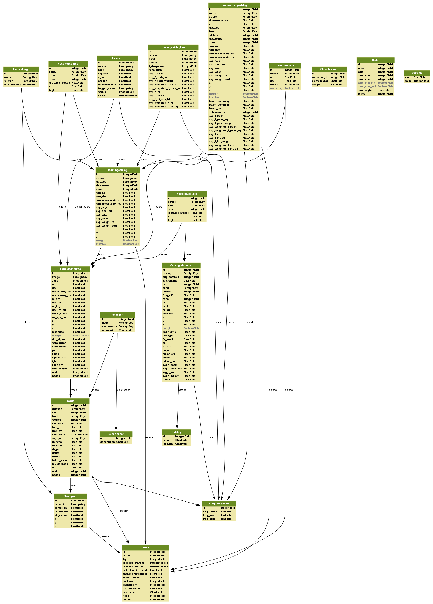

.. _database-schema:

++++++
Schema
++++++

assoccatsource
==============

This table stores the association between an extracted source and one or more
cataloged sources (i.e. VLSS, WENSSm, WENSSp, and NVSS sources).

For every association pair the association parameters, distance_arcsec, r and
loglr are calculated as well. Only source pairs that fullfil the criterion of
an association (:math:`r < r_{lim}`) are accepted and appended to this table.
:math:`r_{lim}` may be specified in the user parsets or tkp.cfg, otherwise it
defaults to 3.717, corresponding to missing :math:`10^{-3}` counterparts
(:ref:`Scheers, 2011 <scheers-2011>`, section 3.2.3).

**xrtsrc**
   This refers to the xtrsrcid of the extractedsource

**catsrc**
   This is the id of the catalogedsource that could be associated to the
   extractedsource as its counterpart

**type**
   Type of the association, determined by the association procedure inside the
   database. See under assocxtrsource for types and their descriptions

**distance_arcsec**
   The distance in arcsec between the associated sources, calculated by the
   database using the dot product and Cartesian coordinates

**r**
   The dimensionless distance (De Ruiter radius) between the associated
   sources. It is determined as the positional differences weighted by the
   errors, calculated by the association procedure inside the database
   (:ref:`Scheers, 2011 <scheers-2011>`, chapter 3).

**loglr**
   The logarithm of the likelihood ratio of the associated sources, defaults to
   NULL if not calculated (:ref:`Scheers, 2011 <scheers-2011>`, chapter 3).

assocxtrsource
==============

This table stores the association between an extracted source and its
runningcatalog counterpart source, where the relation might be of type 1-1, 1-n
or n-1.

**runcat**
   refers to the runcatid in runningcatalog.  It is considered as the "base" id
   of a lightcurve, whereas the lightcurve consist of multiple frequency bands
   and Stokes parameters.

**xtrsrc**
   This is the id of the extracted source that could be associated to
   runningcatalog source.  Together, the runcat_id and the xtrsrc form a unique
   pair.

**type**
    Type of association, and its description.  n-m, where n is the number of
    runningcatalog sources, and m the number of extractedsources. (The
    assignment of numbers is to association types is arbitrary.)

    ``type = 3``
        1-1 association

    ``type = 2``
        base point of a 1-n (one-to-many) association (relates to ``type = 6``)

    ``type = 6``
        associations of 1-n (one-to-many) type. These are updates of
        pre-existing associations, due to the 1-n case (relates to ``type =
        2`` association)

    ``type = 4``
        0-1 (zero-to-one) association, i.e. a new source.

    Note that many-to-1 relations reduce to 1-to-1 and 1-to-many associations.
    Therefore, there is no type specifying such a case.

**distance_arcsec**
   The distance in arcsec between the associated sources, calculated by the
   database using the dot product Cartesian coordinates

**r**
   The dimensionless distance (De Ruiter radius) between the associated
   sources. It is determined as the positional differences weighted by the
   errors, calculated by the association procedure inside the database
   (:ref:`Scheers, 2011 <scheers-2011>`, chapter 3).

**loglr**
   The logarithm of the likelihood ratio of the associated sources, defaults to
   NULL if not calculated (:ref:`Scheers, 2011 <scheers-2011>`, chapter 3).

.. _schema-assocskyrgn:

assocskyrgn
===========
(See also :ref:`skyregion table <schema-skyregion>`.)
This table records which :ref:`runningcatalog <schema-runningcatalog>` sources
we expect to see in any given skyregion. This serves two purposes: 
it allows us to determine when we *do not* see previously detected sources, 
presumably because they have dropped in flux 
(see :py:func:`tkp.db.monitoringlist.get_nulldetections`). 
It also allows us to determine whether a new runningcatalog entry (i.e. 
a newly detected source without associated historical detections) is being 
detected for the first time because it is actually a new transient, or 
if it is simply the first time that region of sky has been surveyed
(see :py:func:`tkp.db.associations._insert_new_transient`).

This table is updated under 2 circumstances:

- A new skyregion is processed, and associations must be made with pre-existing
  runcat entries (see SQL function ``updateSkyRgnMembers``).
- A new runningcatalog source is added, and must be associated with pre-existing
  skyregions 
  (see :py:func:`tkp.db.associations._insert_new_runcat_skyrgn_assocs`).

**runcat**
   References the associated runningcatalog ID.

**skyrgn**
   References the associated skyregion ID.

**distance_deg**
   Records the angular separation between the runningcatalog source and the
   skyregion centre, at time of first association.

catalogedsource
===============

This table contains the sources from renown surveys/catalogues, VLSS, WENSS
and NVSS. The original data (all columns) are downloaded from the CDS Vizier
websites (`VLSS <http://cdsarc.u-strasbg.fr/viz-bin/VizieR?-source=VIII/79>`_,
`WENSS <http://cdsarc.u-strasbg.fr/viz-bin/VizieR?-source=VIII/62>`_ and `NVSS
<http://cdsarc.u-strasbg.fr/viz-bin/VizieR?-source=VIII/65>`_) The catalogues
also contains the exoplanets, of which the entries were provided by
Jean-Mathias Griessmeier.

This table will be pre-loaded in the database, in order to have it available
all the time. As opposed to the runningcatalog, the catalogedsources table is
static and fixed and won't change during runs.

**id**
    Every inserted catalog source gets a unique id, generated sequentially by
    the database.

**catalog**
    The reference id to the catalog from which this source originates from.

**orig_catsrcid**
    The original id of the source as reported in the catalog

**catsrcname**
    The original name of the source as reported in the catalog

**tau**
    The integration time. Defaults to NULL.

**band**
    The reference id to the frequencyband at which this survey was carried out.

**stokes**
    The Stokes parameter. Four possible values 1 - I, 2 - Q, 3 - U, 4 - V.
    (Currently the external catalogues only report the Stokes I values).

**freq_eff**
    The effective frequency (in Hz) of the survey, as reported in the catalog

**zone**
    The zone id in which the source declination resides, calculated by the
    database.  The sphere is devided into zones of equal width: currently
    fixed to 1 degree, and the zone is effectively the truncated declination.
    (``decl`` = 31.3 → ``zone`` = 31, ``decl`` = 31.9 → ``zone`` = 31). This
    column is primarly for speeding up source look-up queries.

**ra**
    The right ascension (RA) of the source in J2000 degrees.

**decl**
    The declination (decl) of the source in J2000 degrees.

**ra_err**
    The 1-sigma error of the source in RA as measured on the sky, in arcsec.

**decl_err**
    The 1-sigma error of the source in decl as measured on the sky, in arcsec.

**x**
    The x-Cartesian coordinate of the source, generated by the database from
    ``ra``, ``decl``: :math:`\cos(decl) * \cos(ra)`.

**y**
    The y-Cartesian coordinate of the source, generated by the database from
    ``ra``, ``decl``: :math:`\cos(decl) * \sin(ra)`.

**z**
    The z-Cartesian coordinate of the source, generated by the database from
    ``ra``, ``decl``: :math:`\sin(decl)`.

**margin**
    Not used, defaults to 0.

**det_sigma**
    The detection level of the source, which none of the current catalogs
    provides, and defaults to 0.

**src_type**
    Only the WENSS catalog reports the source type: M for a multi-component
    source, C for a subcomponent of the parent M, S for a single source and E
    for an extended source. Currently, we associate extracted sources with all
    source types.

**fit_probl**
    WENSS and NVSS report occasional fit problems.

**PA**
    Position angle of fitted major axis, in degrees

**PA_err**
    Error on position angle of fitted major axis, in degrees

**major**
    Major axis of deconvolved component size, in arcsec

**major_err**
    Mean error on major axis, in arcsec

**minor**
    Minor axis of deconvolved component size, in arcsec

**minor_err**
    Mean error on minor axis, in arcsec

**avg_f_peak**
    Peak flux (in Jy) of source. It is prefixed by avg, since its value is
    based on a number of observations, as will also be the case when we add
    LOFAR surveys (MSSS) to this table.

**avg_f_peak_err**
    Mean error on peak flux of source, in Jy

**avg_f_int**
    Integrated flux of source, in Jy

**avg_f_int_err**
    Mean error on integrated flux of source, in Jy

**frame**
    Some catalogs have a reference to a frame/fits image/jpg postage stamp for
    the field the source was detected in.

catalog
=======

This table stores the information about the catalogs that are loaded into the
pipeline database.

**id**
    Every catalog gets a unique id, generated sequentually by the database.

**name**
    An acronym under which the catalog is well-known, e.g. 'NVSS'

**fullname**
    The (nearly) full name under which the catalog is known, e.g. 'NRAO VLA
    Sky Survey'

classification
==============

This table contains classification of transients

.. _dataset:

dataset
=======

This table contains the information about a dataset. A dataset is nothing more
than a collection of images grouped together for processing. When the same
group is reprocessed, and the dataset.inname is identical (e.g. when the
processing runs with other trap parameters), the rerun is incremented by 1, but
the id is auto-incremented as well, treating it as an independent dataset.

**id**
    Every dataset gets a unique id. The id is generated by the database.

**rerun**
    The value indicates how many times a dataset with a given description was
    processed by the pipeline. Note that every dataset still has a unique id,
    even when it was reprocessed.
    At insertion time, by the insertDataset() SQL function, this is incremented
    by 1 when the description of the dataset is already present in the table,
    otherwise defaults to 0.

**type**
    Not being used.

**process_start_ts**
    The timestamp of the start of processing the dataset, generated by the
    database.

**process_end_ts**
    The timestamp of the completion of processing the dataset, generated by
    the database. ``NULL`` if processing is ongoing.

**detection_threshold**
    The detection threshold that was used by source finder to extract sources.
    Value read from either the source finder parset file or the tkp.cfg file.
    See the :ref:`PySE documentation <pyse>` for more information.

**analysis_threshold**
    The analysis threshold that was used by source finder to extract sources.
    Value read from either the source finder parset file or the tkp.cfg file.
    See the :ref:`PySE documentation <pyse>` for more information.

**assoc_radius**
    The association radius that is being used for associating sources. Value
    read from either the source finder parset file or the tkp.cfg file.

**backsize_x**
    Background grid segment size in x. Value read from either the source finder
    parset file or the tkp.cfg file. See the :ref:`PySE documentation <pyse>`
    for more information.

**backsize_y**
    Background grid segment size in y. Value read from either the source finder
    parset file or the tkp.cfg file. See the :ref:`PySE documentation <pyse>`
    for more information.

**margin_width**
    Margin applied to each edge of image (in pixels). Value read from either
    the source finder parset file or the tkp.cfg file. See the :ref:`PySE
    documentation <pyse>` for more information.

**description**
    A description of the dataset, with a maximum of 100 characters.

**node(s)**
    Determine the current and number of nodes in case of a sharded database
    set-up.

.. _schema-extractedsource:

extractedsource
===============

This table contains all the extracted sources (measurements) of an image.
Maybe source is not the right description, because measurements may be made
that were erronous and do not represent a source.

Most values come from the sourcefinder procedures, and some are auxiliary
deduced values generated by the database.

This table is empty *before* an observation. *During* an observation new
sources are inserted into this table. *After* an observation this table is
dumped and transported to the catalog database.

All detections (measurements) found by sourcefinder are appended to this table.
At insertion time some additional auxiliary parameters are calculated by the
database as well. At anytime, no entries will be deleted or updated.
The Trap may add forced-fit entries to this table as well. Then
``extract_type`` is set to 1.

**id**
    Every inserted source/measurement gets a unique id, generated by the
    database.

**image**
    The reference id to the image from which this sources was extracted.

**zone**
    The zone id in which the source declination resides, calculated by the
    database.  The sphere is devided into zones of equal width: currently fixed
    to 1 degree, and the zone is effectively the truncated declination.
    (decl=31.3 => zone=31, decl=31.9 => zone=31). This column is primarly for
    speeding up source look-up queries.

**ra**
    Right ascension of the measurement [in J2000 degrees], calculated by the
    sourcefinder procedures.

**decl**
    Declination of the measurement [in J2000 degrees], calculated by the
    sourcefinder procedures.

**ra_err**
    The 1-sigma error on ra [in degrees], ie. the square root of the 
    quadratic sum of the fitted error (``ra_fit_err``) and the systematic 
    error (``ew_sys_err``) after the latter has been corrected for 
    ra inflation depending on declination. 
    It is calculated by the database at insertion time.
    Note that this error is declination dependent and the source
    lies in the range [ra - ra_err, ra + ra_err].

**decl_err**
    The 1-sigma error on declination [in degrees], ie. the square root of the 
    quadratic sum of the fitted error (``decl_fit_err``) and the systematic error
    (``ns_sys_err``), calculated by the database at insertion time.
    Note that the source lies in the range [decl - decl_err, decl + decl_err]

**uncertainty_ew**
    The 1-sigma on-sky error on ra (in the east-west direction) [in degrees], 
    ie. the square root of the quadratic sum of the error radius (``error_radius``) 
    and the systematic error (``ew_sys_err``).
    It is calculated by the database at insertion time.
    Note that this is a positional uncertainty and is declination independent. 
    This error is being used in the De Ruiter calculations.

**uncertainty_ns**
    Analogous to uncertainty_ew.

**ra_fit_err**
    The 1-sigma error on ra [in degrees] from the source gaussian fitting, calculated by the
    sourcefinder procedures. It is important to note that a source's fitted ra error increases
    towards the poles, and is thus declination dependent (see also error_radius). 

**decl_fit_err**
    The 1-sigma error from the source fitting for declination [in degrees],
    calculated by the sourcefinder procedures (see also error_radius). 

**ew_sys_err**
    The systematic error on RA [arcsec]. 
	(As an on-sky angular uncertainty, independent of Declination.)
	It is a telescope dependent error and is provided by the user in the parset file.

**ns_sys_err**
    Analogous to ew_sys_err.

**error_radius**
    Estimate of the absolute angular error on a source's central position [arcsec]. 
    It is a pessimistic estimate, because it takes the sum of the error along the X and Y axes.

**x, y, z**
    Cartesian coordinate representation of (ra,decl), calculated by the
    database at insertion time.

**racosdecl**
    The product of ra and cosine of the declination. Helpful in source look-up
    association queries where we use the De Ruiter radius as an association
    parameter.

**margin**
    Used for association procedures to take into account sources that lie close
    to ra=0 & ra=360 meridian.
    * True: source is close to ra=0 meridian
    * False: source is far away enough from the ra=0 meridian
    * NOTE & TODO: This is not implemented yet.

**det_sigma**
    The sigma level of the detection (Hanno's thesis): 20*(f_peak/det_sigma)
    gives the rms of the detection. Calculated by the sourcefinder procedures.

**semimajor**
    Semi-major axis that was used for gauss fitting [in arcsec], calculated by
    the sourcefinder procedures.

**semiminor**
    Semi-minor axis that was used for gauss fitting [in arcsec], calculated by
    the sourcefinder procedures.

**pa**
    Position Angle that was used for gauss fitting [from north through local
    east, in degrees], calculated by the sourcefinder procedures.

**f_peak**
    peak flux [Jy], calculated by the sourcefinder procedures.

**f_peak_err**
    1-sigma error (in Jy) of ``f_peak``, calculated by the sourcefinder
    procedures.

**f_int**
    integrated flux [Jy], calculated by the sourcefinder procedures.

**f_int_err**
    1-sigma error (in Jy) of ``f_int``, calculated by the sourcefinder
    procedures.

**extract_type**
    Reports how the source was extracted by sourcefinder (Hanno's thesis),
    generated by the sourcefinder procedures. Currently implemented values
    are:

        * ``0``: blind fit
        * ``1``: forced fit to pixel

**node(s)**
    Determine the current and number of nodes in case of a sharded database
    set-up.

frequencyband
=============

This table contains the frequency bands that are being used inside the
database.  Here we adopt the set of pre-defined Standard LOFAR Frequency Bands
and their bandwidths as defined for `MSSS
<http://www.lofar.org/wiki/doku.php?id=msss:documentation#standard_msss-lba_frequency_bands>`_.
Included are frequency bands outside the LOFAR bands, in order to match the
external catalogue frequency bands.  When an image is taken at an unknown
band, it is added to this table by the SQL function ``getBand()``. To make it
possible to easily compare images with slightly different effective
frequencies, new bands are constructed by rounding the effective frequency to
the nearest MHz, and assuming a band width of 1 MHz.

**id**
    Every frequency band has its unique id, generated by the database.

**freq_central**
    The central frequency (in Hz) of the defined frequency band. (Note that this is not
    the effective frequency, which is stored as a property in the image table.)

**freq_low**
    The low end of the frequency band (Hz).

**freq_high**
    The high end of the frequency band (Hz).

image
=====

This table contains the images that are being or were processed in the Trap.
Note that the format of the image is not stored as an image property.  An
image might be a composite of multiple images, but it is not yet defined how
the individual values for effective frequency, integration times, etc are
propagated to the columns of the ``image`` table.  `The CASA Image description
for LOFAR
<http://www.lofar.org/operations/lib/exe/fetch.php?media=public:documents:casa_image_for_lofar_0.03.00.pdf>`_
describes the structure of a LOFAR CASA Image, from which most of the data of
the ``image`` table originates from.

An image is characterised by

* observation timestamp (taustart_ts).
* integration time (tau)
* frequency band (band)
* Stokes parameter (stokes)

A group of images that belong together (defined by user, but not specified any
further) are in the same data set (i.e. they have the same reference to
dataset).

**id**
    Every image gets a unique id, generated by the database.

**dataset**
    The dataset to which the image belongs.

**tau**
    The integration time of the image. This is a quick reference number related
    to tau_time, similar as to which band is related to central frequency.
    Currently this is not used.

**band**
    The frequency band at which the observation was carried out. Its value
    refers to the id in frequencyband, where the frequency bands are
    predefined. The image's effective frequency falls within this band. If an
    image has observation frequency that is not in this table, a new entry will
    be created based an the effective

**stokes**
    The Stokes parameter of the observation. 1 = I, 2 = Q, 3 = U and 4 = V.
    The Stokes parameter originates or is read from the CASA Main table in the
    coords subsection from the ``stokesX`` record.
    The char value is converted by the database to one of the four (tiny)
    integers.

**tau_time** 
    The integration time (in seconds) of the image. 
    The value originates or is read from the CASA LOFAR_OBSERVATION table 
    by differencing the ``OBSERVATION_END`` and ``OBSERVATION_START`` data
    fields. 

**freq_eff** 
    The effective frequency (or synonymously rest frequency) (in Hz) at 
    which the observation was carried out. 
    The value originates or is read from the CASA Main table in the coords
    subsection from the ``spectralX`` record and the ``crval`` field. 
    Note that in the case of FITS files the header keywords representing the
    effective frequency are not uniquely defined and may differ per FITS file. 

**freq_bw** 
    The frequency bandwidth (in Hz) of the observation. 
    Value originates or is read from the CASA Main table in the coords
    subsection from the ``spectralX`` record and the ``cdelt`` field. N
    This is a required value and when it is not available an error is thrown.

**taustart_ts** 
    The timestamp of the start of the observation, originating or read from 
    the CASA LOFAR_OBSERVATION table from the ``OBSERVATION_START`` data field.

**rb_smaj** 
    The semi-major axis of the restoring beam, in degrees. 
    Full major axis value originates or is read from the CASA Main table in the imageinfor
    subsection from the ``restoringbeam`` record and is converted at db insertion time.

**rb_smin** 
    The semi-minor axis of the restoring beam, in degrees. 
    Full minor axis value originates or is read from the CASA Main table in the imageinfor
    subsection from the ``restoringbeam`` record and is converted at db insertion time.

**rb_pa** 
    The position angle of the restoring beam (from north to east to the major
    axis), in degrees. 
    Value originates or is read from the CASA Main table in the imageinfor
    subsection from the ``restoringbeam`` record. 

**fwhm_arcsec**
    The full width half maximum of the primary beam, in arcsec. Value not yet
    stored in table.

**fov_degrees**
    The field of view of the image, in square degrees. Not yet stored in table.

**url** 
    The url of the physical location of the image at the time of processing.
    NOTE that this needs to be updated when the image is moved.

**node(s)** 
    Determine the current and number of nodes in case of a sharded database
    set-up.

monitoringlist
==============

This table contains the list of sources that are monitored. This implies that
the source finder software will measure the flux in an image at exactly the
given position.  These positions are 0 by default, since they can be retrieved
by joining with the runningcatalog.

For user defined sources, however, positions may be available that are more
precise than those in the runningcatalog.  Hence the ra and decl columns are
still necessary for these sources.  The runcat refers to the id in the
runningcatalog, when available.  Eg, manually inserted sources with positions
obtained differently will not have a runcat to start with (in which case
runcat will have the NULL value), until the first time the flux has been
measured; then these sources (even when actual upper limits) will be inserted
into extractedsources and runningcatalog, and have a runcat.  They will still
have userentry set to true, so that the position used is that in this table
(the more precise position), not that of the runningcatalog.

**id**
    Every source in the monitoringlist gets a unique id

**runcat**
    Refers to the id in runningcatalog.

**ra**
    The Right Ascension (J2000) of the source

**decl**
    The Declination (J2000) of the source

**dataset**
    Refers to the id in dataset, to which this monitoringlist belongs to.

**userentry**
    Boolean to state whether it is an user inserted soure (true) or by the trap
    (false)

node
====

This table keeps track of zones (declinations) of the stored sources on the
nodes in a sharded database configuration. Every node in such a set-up will
have this table, but with different content.

**node**
    The id of the node

**zone**
    The zone that is available on the node

**zone_min**
    The minimum zone of the zones

**zone_max**
    The maximum zone of the zones

**zone_min_incl**
    Boolean determining whether the minimum zone is included.

**zone_max_incl**
    Boolean determining whether the maximum zone is included.

**zoneheight**
    The zone height of a zone, in degrees

**nodes**
    The total number of nodes in the sharded database configuration.

.. note::

   The following sections on the ``runningcatalog``, ``runningcatalog_flux`` and
   ``temprunningcatalog_flux`` are annotated using the style of mathematical
   notations developed in the :ref:`Appendix <mathematical-diversion>`.

.. _schema-runningcatalog:

runningcatalog
==============
(See :ref:`mathematical-diversion` for explanation of mathematical notation.)

While a single entry in ``extractedsource`` corresponds to an individual
source measurement, a single entry in ``runningcatalog`` corresponds to a
unique astronomical source detected in a specific dataset (series of images).
The position of this unique source is a weighted mean of all its individual
source measurements.  The relation between a ``runningcatalog`` source and all
its measurements in ``extractedsource`` is maintained in ``assocxtrsource``.

The association procedure matches extracted sources with counterpart
candidates in the runningcatalog table.  Depending on their association
parameters (distance and De Ruiter radius) of the ``runningcatalog`` source
and ``extractedsource`` source, the source pair ids are added to
``assocxtrsource``.  The source properties, position, fluxes and their errors
in the ``runningcatalog`` and ``runningcatalog_flux`` tables are then updated
to include the counterpart values from the extracted source as a new
datapoint.

If no counterpart could be found for an extracted sources, it is appended to
``runningcatalog`` as a "new" source (datapoint=1).

**id**
    Every source in the running catalog gets a unique id.

**xtrsrc**
    The id of the extractedsource for which this runningcatalog source was
    detected for the first time.

**dataset**
    The dataset to which the runningcatalog source belongs to.

**datapoints** :math:`= N_\alpha` or equivalently :math:`N_\delta`
    The number of datapoints (or number of times this source was detected)
    that is included in the calculation of the *position* averages.  It is
    assumed that a source's position stays relatively constant across bands
    and therefore all bands are included in averaging the position.

**zone**
    The zone id in which the source declination resides.  The sphere is divided
    into zones of equal width: here fixed to 1 degree, and the zone is
    effectively the truncated declination. (decl=31.3 => zone=31, decl=31.9 =>
    zone=31)

**wm_ra** :math:`= \xi_{\alpha}`
    The weighted mean of RA of the source [in J2000 degrees].

**wm_decl** :math:`=\xi_{\delta}`
    The weighted mean of Declination of the source [in J2000 degrees].

**wm_uncertainty_ew**
    The positional on-sky uncertainty in the east-west direction of the weighted 
    mean RA [in degrees].

**wm_uncertainty_ns**
    The positional on-sky uncertainty in the north-south direction of the 
    weighted mean Dec [in degrees].

**avg_ra_err**
    The average of the ra_err of the source [in degrees]

**avg_decl_err**
    The average of the decl_err of the source [in degrees]

**avg_wra** :math:`=\overline{w_{\alpha}\alpha}`
    The average of ra/uncertainty_ew^2, used for calculating the weighted mean 
    of the RA.

**avg_wdecl** :math:`=\overline{w_{\delta}\delta}`
    Analogous to avg_wra.

**avg_weight_ra** :math:`=\overline{w_{\alpha}}`
    The average of 1/uncertainty_ew^2, used for calculating the weighted mean 
    of the RA.

**avg_weight_decl**   :math:`=\overline{w_{\delta}}`
    Analogous to avg_weight_ra

**x, y, z**
    The Cartesian coordinate representation of wm_ra and wm_decl

**margin**
    Boolean to define that a source is near the 360-0 meridian. Not being used.

**inactive**
    Boolean to set an entry to inactive.  This is done during the :ref:`source
    association <database-assoc>` procedure, where e.g. the many-to-many cases
    are handled and an existing entry is replaced by two or more entries.

.. _schema-runningcatalog-flux:

runningcatalog_flux
===================

The runningcatalog_flux table contains the averaged flux measurements of a
runningcatalog source, per band and stokes parameter. The combination runcat,
band and stokes is the primary key.

The flux squared and weights are used for calculations of the variability
indices, V and eta.

**runcat**
    Reference to the runningcatalog id to which this band/stokes/flux belongs
    to

**band**
    Reference to the frequency band of this flux

**stokes**
    Stokes parameter: 1 = I, 2 = Q, 3 = U, 4 = V

**f_datapoints**   :math:`=N_I`  
    the number of *flux* datapoints for which the flux averages were calculated.

**resolution**
    Not used.

**avg_f_peak**  :math:`=\overline{I}` 
   Average of peak flux

**avg_f_peak_sq** :math:`=\overline{{I}^2}`
    Average of (peak flux)^2

**avg_f_peak_weight**    :math:`=\overline{w_{I}}` 
   Average of one over peak flux errors squared

**avg_weighted_f_peak** :math:`=\overline{w_{I} I}`
    Average of ratio of (peak flux) and (peak flux errors squared)

**avg_weighted_f_peak_sq** :math:`=\overline{w_{I} I^2}` 
   Average of (weighted peak flux squared)

**avg_f_int, avg_f_int_sq, avg_f_int_weight, avg_weighted_f_int, avg_weighted_f_int_sq**
   Analogous to those above, except for the *integrated* flux.

.. _schema-skyregion:

skyregion
=========
Entries in this table represent regions of sky which have been, or will shortly
be, processed via the usual extract-sources-and-associate procedures.
By listing regions of sky in a dedicated table, we de-duplicate
information that would otherwise be repeated for many images.

When an image is first inserted into the database, the SQL function
``getSkyRgn`` is called. This first checks for the pre-existence of a 
matching skyregion entry. If none exists, then a new entry is created and 
the SQL function ``updateSkyRgnMembers`` is called to update the 
:ref:`assocskyrgn <schema-assocskyrgn>` table as necessary.

See also :ref:`assocskyrgn <schema-assocskyrgn>`.

**dataset**
   Reference to the ``dataset`` id, for the dataset to which the skyregion 
   belongs. This field is needed in order to restrict association to the 
   current dataset.

**centre_ra** and **centre_decl**
    The central coordinates (J2000) (or pointing centre) of the region, in
    degrees.
    RA and Dec values are read from ``DataAccessor`` metadata. 

**xtr_radius**
   The radius of the circular mask used for source extraction, in degrees.
   This is calculated from the 'extraction_radius_pix' parameter and the image
   metadata during the 'persistence' image loading steps.

**x**, **y** and **z**
    The Cartesian coordinates of centre_ra and centre_decl. 
    Values are calculated by the database from centre_ra and centre_decl.

.. _database_temprunningcatalog:

temprunningcatalog
==================
(See also :ref:`source association detailed logic <database-assoc-details>`.)

Most of the entries in the ``temprunningcatalog`` are identical to those of the 
same name in :ref:`schema-runningcatalog` and :ref:`schema-runningcatalog-flux`,
except updated to include the information from a new ``extractedsource``. 
Those without direct counterparts in those tables are listed below. 

**runcat**
    Reference to the ``runningcatalog`` id. runcat and xtrsrc together form a
    unique combination.

**xtrsrc**
    Reference to the ``extractedsource`` id. runcat and xtrsrc together form a
    unique combination.

**distance_arcsec**
    The distance in arcsec on the sky of the runcat-xtrsrc association,
    calculated by the database.

**r**
    The De Ruiter radius of the runcat-xtrsrc association, calculated by the
    database.

**inactive**
    During evaluation of the association pairs, some pairs might be set to
    inactive (TRUE), defaults to FALSE.

**beam_semimaj, beam_semimin, beam_pa**
    Not used (yet)

.. _schema-transient:

transient
=========

This table contains the detected transients and their characteristics. Based on
the values of the variability indices a source is considered a transient and
appended to the transient table.

We choose to test the null hypothesis, :math:`H_0`, that the source under
consideration is not variable. Contributing terms to :math:`\eta_{\nu}` in the
sum will be of the order of unity, giving a value of roughly one after
:math:`N` measurements.  With the integral probability, we can quantify the
probability of having a value equal to or larger than the :math:`\eta_{\nu}`
obtained from the measurements.

**id**
    Every source in the transient table gets a unique id, set by the database

**runcat**
    Reference to the runningcatalog source to which this transient belongs to.
    Since every trasient has an entry in th erunningcatalog this cannot be
    NULL.

**band**
    The frequency band in which the transient was found, and for which th
    evariability are calculated

**siglevel**
    The significance level of the 2nd variability index value. Calculated by
    the scipy module chisqprob(), where we use :math:`N-1` as the degree of
    freedom

**v_int**
    The first variability index, :math:`V_{\nu}`, based on the integrated flux
    values.

**eta_int**
    The second variability index, :math:`\eta_{\nu}`, based on the integrated
    flux values.

**detection_level**
    Currently not set

**trigger_xtrsrc**
    Reference to the extracted source id that caused this transient to be added

**status**
    Currently not set

**t_start**
    Currently not set

version
=======

This table contains the current schema version of the database. Every schema
upgrade will increment the value by 1.

**name**
    The name of the version

**value**
    The version number, which increments after every database change

rejectreason
============

This table contains all the possible reasons for rejecting an image.

**id**
    The database ID of the rejectreason

**description**
    An description of the rejection

rejection
=========

This table contains all rejected images and a reference to the reason.

**id**
    The database ID of the rejection

**image**
    A foreign key relationship to the image ID of the rejected image

**rejectreason**
    A foreign key relationship to the ID of the rejectreason

**comment**
    A textfield with more details about the rejectedreason. For example in the
    case of a rejection because of RMS value to high, this field will contain
    the theoretical noise value and the calculated RMS value of the image.

++++++++++
Appendices
++++++++++

.. _mathematical-diversion:

Mathematical diversion
======================

On iteratively updated weighted means
-------------------------------------
We now take a diversion to note the mechanics of storing and updating weighted
means - this happens a lot in the database.

We define the average (specifically, the *arithmetic mean*) of :math:`x` as

.. math::

    \overline{x}_N = \frac{1}{N} \sum_{i=1}^{N} x_i

where :math:`x_i` is the :math:`i` th measurement of :math:`x`.

We may update this in an iterative fashion.
If we add the next datapoint, :math:`x_{N+1}`, to it, we can build the
new average as:

.. math:: \overline{x}_{N+1} = \frac{N \overline{x}_N + x_{N+1}}{N+1} .
   :label: simple_mean_update

We now treat weighted means.

We first define the weight of the :math:`i` th measurement of x,

.. math::
   w_{x_i} = 1/{e_{x_i}}^2

where :math:`e_{x_i}` is the one-sigma error in the :math:`i` th measurement
of x.

We can now define a weighted mean of N measurements of :math:`x`;
:math:`\xi_{x_N}` as:

.. math::

    \xi_{x_N} = \frac{\sum_{i=1}^{N} w_{x_i} x_i}{\sum_{i=1}^{N} w_{x_i}}.

To update this weighted average,
we first define the sum of the weights as

.. math::

    W_{x_N} = \sum_{i=1}^{N} w_{x_i}

we may then calculate the  weighted average after N+1 measurements as:

.. math:: \xi_{x_{N+1}} =   \frac{ W_{x_N} \xi_{{x_N}} + w_{{x_{N+1}}}x_{N+1}}
                                 { W_{x_N} + w_{x_{N+1}} }
   :label: wt_mean_update_1

Note, if we define the mean or 'bar' operator such that:

.. math::

   \overline{y}_{N} = \frac{\sum_{i=1}^{N} y_i}{N}

for any variable :math:`y`, then

.. math::

   \overline{w}_{x_N} = \frac{\sum_{i=1}^{N} w_{x_i}}{N} = \frac{W_{x_N}}{N}

and we may use the formula:

.. math:: \xi_{x_{N+1}} =
    \frac{ N \overline{w}_{x_N} \xi_{x_N} + w_{x_{N+1}}x_{N+1}}
         { N \overline{w}_{x_N} + w_{x_{N+1}} }
   :label: wt_mean_update_2

(Note how this simplifies if :math:`w_i = 1 \quad \forall i`)

.. warning::
   For tracking Ra and Dec  (:math:`\alpha` and :math:`\delta`) weighted
   means, we substitute

   .. math::  N \overline{ w_{\alpha_N} } \xi_{\alpha_N} =
              N \overline{ (w_{\alpha} \alpha )_N}

   to yield another manipulation of the update formula:

   .. math:: \xi_{\alpha_{N+1}} =
       \frac{ N \overline{ (w_{\alpha} \alpha )_N} + w_{\alpha_{N+1}}\alpha_{N+1}}
            { N \overline{w}_{\alpha_N} + w_{\alpha_{N+1}} }
      :label: wt_mean_update_3

   **Note that this requires that we also keep track of the extra aggregate
   value:** :math:`\overline{ (w_{\alpha} \alpha )_N}`, which is probably
   unnecessary given that we are not performing reduced-:math:`\chi^2` stats
   on the position.

In general, we perform similar tricks with aggregate values (i.e. storing the
'barred' values of variables) throughout the database code. This has pros and
cons - it makes the equations below a little prettier (and possibly simpler to
compute), but requires many multiplications and divisions by the factor
:math:`N` (hence, also possibly harder to compute - this may be worth careful
consideration during the next big code review).

On 'aggregated' variability indexes
-----------------------------------

We now explain how running averages are used to compute the 'variability indices'
we use in identifying sources which may be intrinsically transient or variable.
Adapted from :ref:`Scheers (2011) <scheers-2011>`.

The first variability indicator, the proportional flux variability of a
source, is expressed as the ratio of the sample standard deviation, and mean,
of the flux :math:`I`; that is to say:

.. math::

   V = \frac{ s}{ \overline{I} }

where :math:`s` is the unbiased sample standard deviation:

.. math::

   s = \sqrt{ \frac{1}{N-1} \sum_{i=1}^N \left( I_i - \overline{I}  \right)^2 }

.. note::

   In general, we may consider calculating all these values per frequency-band
   and subscript them by band central frequency :math:`\nu`, but we neglect such
   details here for simplicity.

Written in its well known 'aggregate' form, it is now easy to handle bulk
data, and is defined as

.. math::

    V = \frac{1}{\overline{I}}
              \sqrt{ \frac{N}{N-1}
                        \left( \overline{{I}^2} - \overline{I}^2  \right)
                   }

The second indicator, the significance of the flux variability, is based on
reduced :math:`\chi^2` statistics. We derive the aggregate form here.

We begin with the familiar reduced-:math:`\chi^2` formula, except with the
regular arithmetic mean :math:`\overline{I}` replaced by the
weighted mean :math:`\xi_{I_N}`,

.. math::

   \xi_{I_N} = \frac{\sum_{i=1}^{N} w_i I_i}{\sum_{i=1}^{N} w_i}
         = \frac{\overline{w_i I_i} }{ \overline{w_i}},

resulting in:

.. math::

   \eta = \frac{1}{N-1}
                 \sum_{i=1}^N
                    \frac{\left(I_i - \xi_{I_N} \right)^2}
                        {e_i^2}

where :math:`e_i` is the estimated uncertainty, or standard deviation,
in :math:`I_i`.  We may rewrite this using :math:`\frac{1}{e_i^2} = w_i`:

.. math::

   \eta = \frac{N}{N-1}\lgroup \frac{1}{N}
                 \sum_{i=1}^N w_i \left(I_i - \xi_{I_N} \right)^2 \rgroup

Expanding inside the brackets gives:

.. math::
   \frac{1}{N}\sum_{i=1}^N
      w_i \left( I_i^2 - 2\xi_{I_N} I_i + \xi_{I_N}^2 \right)

    = \frac{1}{N} \sum_{i=1}^N w_i I_i^2
      - 2\xi_{I_N} \frac{1}{N}\sum_{i=1}^N w_i I_i
      + \xi_{I_N}^2 \frac{1}{N}\sum_{i=1}^N w_i

   = \overline{w_i I_i^2} - 2\xi_{I_N} \overline{w_i I_i} +\xi_{I_N}^2 \overline{w_i}
      \qquad .

Expanding for :math:`\xi_{I_N}` results in the final aggregate form of
the reduced-:math:`\chi^2`:

.. math::

    \eta = \frac{N}{N-1}
                 \left(
                    \overline{w {I}^2}
                    -
                    \frac{\overline{w I}^2}{\overline{w}}
                 \right)
