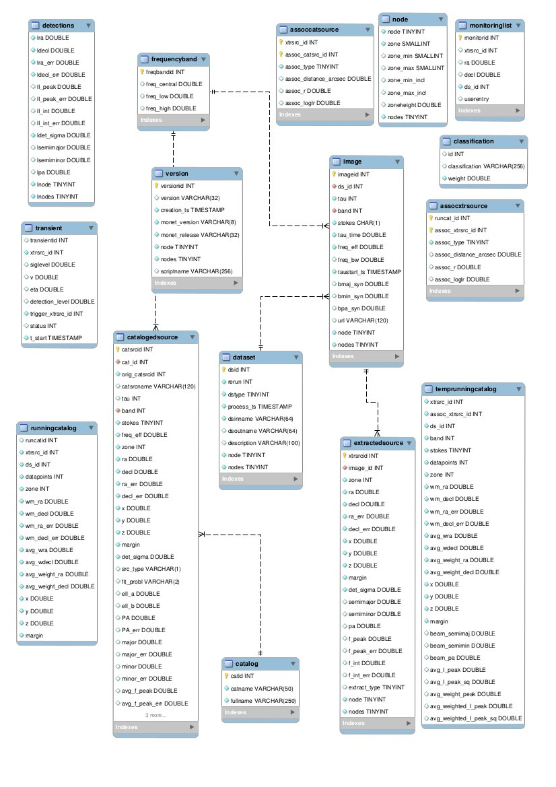

.. _database_schema:

++++++
Schema
++++++

assoccatsource
==============

This table stores the associations between extracted sources and cataloged sources (i.e. VLSS, WENSSm, WENSSp, and NVSS sources). 

For every association pair the association parameters, distance_arcsec, r and loglr are calculated as well. Only source pairs that fullfil the criterion of an association (r < r_lim) are accepted and appended to this table. r_lim may be specified in tkp.cfg, or otherwise defaults to 3.717, corresponding to missing 10^{-3} counterparts (see Scheers's thesis, section 3.2.3)

**xrtsrc**
   This refers to the xtrsrcid of the extractedsource

**catsrc**
   This is the id of the catalogedsource that could be associated to the extractedsource as its counterpart

**type**
   Type of the association. See under assocxtrsource for a description

**distance_arcsec**
   The distance in arcsec between the associated sources

**r**
   The dimensionless distance (De Ruiter radius) between the associated sources. It is determined as the positional differences weighted by the errors (Scheers thesis ch3).

**loglr**
   The logarithm of the likelihood ratio of the associated sources (Scheers thesis ch3).

assocxtrsource
==============

This table stores the associations between extracted sources and the running catalog.

**runcat**
   refers to the runcatid in runningcatalog.  It is the "base" id of a series of polarized spectral lightcurve datapoints.

**xtrsrc** 
   This is the id of the extracted source that could be associated to runningcatalog source.  Together, the runcat_id and the xtrsrc form a unique pair.

**type**
    Type of association.  x-y, where x is the number of runningcatalog sources, and y the number of extractedsources
    1. 1-1
    2. 1-n
    3. n-1
    4. n-m
    5. 0-1

**distance_arcsec**
   The distance in arcsec between the associated sources.

**r**
   The dimensionless distance (De Ruiter radius) between the associated sources. It is determined as the positional differences weighted by the errors (Scheers thesis ch3).

**loglr**      
   The logarithm of the likelihood ratio of the associated sources (Scheers thesis ch3).

catalogedsource
===============

This table contains the sources from renown surveys/catalogues, VLSS, WENSS and NVSS. It also contains the exoplanets, of which the entries were provided by Matthias Griessmeier. 

This table will be pre-loaded in the database, in order to have it available all the time. As opposed to the runningcatalog, the catalogedsources table is fixed and won't change during runs.

**id**
    Every inserted catalog source gets a unique id.
    
**catalog** 
    The reference id to the catalog from which this source originates from.
     
**orig_catsrcid**
    The original id of the source as reported in the catalog

**catsrcname**
    The original name of the source as reported in the catalog
    
**tau**
    The integration time. Defaults to NULL.

**band**
    The reference id to the frequencyband at which this survey was carried out.

**stokes**
    The Stokes parameter. Four possible values 1 - I, 2 - Q, 3 - U, 4 - V.

**freq_eff**
    The effective frequency of the survey, in Hz.

**zone**
    The zone id in which the source declination resides.  The sphere is devided into zones of equal width: here fixed to 1 degree, and the zone is effectively the truncated declination. (decl=31.3 => zone=31, decl=31.9 => zone=31)
    
**ra**
    The right ascension (RA) of the source in J2000 degrees.
    
**decl**
    The declination (decl) of the source in J2000 degrees.

**ra_err**
    The 1-sigma error of the source in RA as measured on the sky, in arcsec.

**decl_err**
    The 1-sigma error of the source in decl as measured on the sky, in arcsec.

**x**
    The x-Cartesian coordinate of the source, generated from ra, decl: COS(decl) * COS(ra)
                    .
**y**
    The y-Cartesian coordinate of the source, generated from ra, decl: COS(decl) * SIN(ra)
    
**z**
    The z-Cartesian coordinate of the source, generated from ra, decl: SIN(decl)
    
**margin**
    Not used, defaults to 0. 

**det_sigma**
    The detection level of the source, which none of the current catalogs provides, and defaults to 0.

**src_type**
    Only the WENSS catalog reports the source type: M for a multi-component source, C for a subcomponent of the parent M, S for a single source and E for an extended source. Currently, we associate extracted sources with all source types.

**fit_probl**
    WENSS and NVSS report occasional fit problems.

**PA**
    Position angle of fitted major axis, in degrees

**PA_err**
    Error on position angle of fitted major axis, in degrees

**major**
    Major axis of deconvolved component size, in arcsec

**major_err**
    Mean error on major axis, in arcsec

**minor**
    Minor axis of deconvolved component size, in arcsec

**minor_err**
    Mean error on minor axis, in arcsec

**avg_f_peak**
    Peak flux of source, in Jy

**avg_f_peak_err**
    Mean error on peak flux of source, in Jy

**avg_f_int**
    Integrated flux of source, in Jy

**avg_f_int_err**
    Mean error on integrated flux of source, in Jy

**frame**
    Some catalogs have a reference to a frame/fits image/jpg postage stamp for the field the source was detected in.

catalog
=======

This table stores the information about the catalogs that are loaded into the pipeline database. 

**id**
    Every catalog gets a unique id.

**name**
    An acronym under which the catalog is well-known, f.ex. 'NVSS'

**fullname**
    The full name under which the catalog is known, f.ex. 'NRAO VLA Sky Survey'

classification
==============

This table contains classification of transients

dataset
=======

This table contains the information about a dataset. A dataset is nothing more than a collection of images grouped together for processing. When the same group is reprocessed, and the dataset.inname is identical (f.ex. when the processing runs with other trap parameters), the rerun is incremented by 1, but also the id is auto-incremented

**id**
    Every dataset gets a unique id.

**rerun**
    At insertion, with the insertDataset() SQL function, this is incremented by 1 when the inname
    is present, otherwise defaults to 0.

**process_ts**
    The timestamp of the start of processing the dataset

**inname** 
    A description of the dataset.

**description** 
    A description of the dataset.

extractedsource
===============

This table contains all the extracted sources during an observation.  Maybe source is not the right description, because measurements may be made that were erronous and do not represent a source.

This table is empty BEFORE an observation.  DURING an observation new sources are inserted into this table AFTER an observation this table is dumped and transported to the catalog database.

**id**
    Every inserted source/measurement gets a unique id.

**image**
    The reference id to the image from which this sources was extracted.

**zone**
    The zone id in which the source declination resides.  The sphere is devided into zones of equal width: here fixed to 1 degree, and the zone is effectively the truncated declination. (decl=31.3 => zone=31, decl=31.9 => zone=31)

**ra**
    Right ascension of the measurement [in J2000 degrees]

**decl**
    Declination of the measurement [in J2000 degrees]

**ra_err**
    The 1-sigma error of the ra measurement [in arcsec]

**decl_err**
    The 1-sigma error of the declination measurement [in arcsec]

**x, y, z**
    Cartesian coordinate representation of (ra,decl)

**margin**
    Used for association procedures to take into account sources that lie close to ra=0 & ra=360 meridian.
    * True: source is close to ra=0 meridian
    * False: source is far away enough from the ra=0 meridian
    * NOTE & TODO: This is not implemented yet.

**det_sigma**
    The sigma level of the detection (Hanno's thesis): 20*(f_peak/det_sigma) gives the rms of the detection.

**semimajor**
    Semi-major axis that was used for gauss fitting [in arcsec]

**semiminor**
    Semi-minor axis that was used for gauss fitting [in arcsec]

**pa**
    Position Angle that was used for gauss fitting [from north through local east, in degrees]

**f_peak**
    peak flux [Jy]

**f_int**
    integrated flux [Jy]

**f_peak/int_err**
    1-sigma errors respectively [Jy]

**type**
    Reports how the source was extracted by sourcefinder (Hanno's thesis):

    1: gaussian fit
    2: moments fit
    3: forced fit to pixel

**node(s)**
    Determine the current and number of nodes in case of a sharded database set-up.

frequencyband
=============

This table contains the frequency bands that are available during an observation and for the cataloged sources. 

**id**
    Every frequency band has its unique id.

**freq_central**
    The central frequency of the defined frequency band. (Note that this is not the effective frequency, which is stored as a property in the image table.)

**freq_low**
    The low end of the frequency band

**freq_high**
    The high end of the frequency band

image
=====

This table contains the images that are being or were processed in the trap.  The only format for now is FITS. The HDF5 format will be implemented later.

An image is characterised by

* observation timestamp (taustart_ts).
* frequency band (band) 
* integration time (tau)

A group of images that belong together (defined by user, but not specified any further) are in the same data set (i.e. they have the same dataset).

**id**
    Every image gets a unique id.

**dataset**
    The dataset to which the image belongs to

**tau** 
    The integration time of the image. This is a quick reference number related to tau_time, similar to band related to central frequency.

**band** 
    The frequency band at which the observation was carried out

**stokes** 
    The Stokes parameter of the observation. 1 = I, 2 = Q, 3 = U and 4 = V.

**tau_time** 
    The integration time of the image, in seconds.

**freq_eff** 
    The effective frequency at which the observation was carried out, in Hz

**freq_bw** 
    The frequency bandwidth of the observation, in Hz

**taustart_ts** 
    The timestamp of the start of the observation

**centre_ra and centre_decl**
	The central coordinates (J2000) of the image in degrees.

**x, y and z**
    The Cartesian coordinates of centre_ra and centre_decl.

**bmaj_syn** 
    The beam major axis of the synthesized beam, in arcsec.

**bmin_syn** 
    The beam minor axis of the synthesized beam, in arcsec.

**bpa_syn** 
    The position angle of the synthesized beam (from north to east to the major axis), in degrees.

**fwhm_arcsec**
    The full width half maximum of the primary beam, in arcsec.

**fov_degrees**
    The field of view of the image, in square degrees.

**url** 
    The url of the physical location of the image at the time of processing.

**node(s)** 
    Determine the current and number of nodes in case of a sharded database set-up.

monitoringlist
==============

This table contains the list of sources that are monitored. This implies that the source finder software will measure the flux in an image at exactly the given position. 

These positions are 0 by default, since they can be retrieved by joining with the runningcatalog.

For user defined sources, however, positions may be available that are more precise than those in the runningcatalog. Hence the ra and decl columns are still necessary for these sources.  The xtrsrc_id refers to the xtrsrc_id in the runningcatalog, when available. Eg, manually inserted sources with positions obtained differently will not have an xtrsrc_id to start with (hence the default of -1), until the first time the flux has been measured; then these sources (even when actual upper limits) will be inserted into extractedsources and runningcatalog, and have an xtrsrc_id.  They will still have userentry set to true, so that the position used is that in this table (the more precise position), not that of the runningcatalog.

node
====

This table keeps track of zones (declinations) of the stored sources on the nodes in a sharded database configuration. Every node in such a set-up will have this table, but with different content.

**node**
    The id of the node
**zone**
    The zone that is available on the node
**zone_min**
    The minimum zone of the zones
**zone_max**
    The maximum zone of the zones
**zone_min_incl**
    Boolean determining whether the minimum zone is included.
**zone_max_incl**
    Boolean determining whether the maximum zone is included.
**zoneheight** 
    The zone height of a zone, in degrees
**nodes**
    The total number of nodes in the sharded database configuration.

runningcatalog
==============

This table contains all the unique sources that are being detected during an observation.
Extracted sources are being positionally matched with counterpart candidated in the runningcatalog table. Depending on their association parameters the extracted source -- runningcatalog source pair is being added to the assocxtrsource. The source properties, position, fluxes and errors in the runningcatalog and -_flux tables are then updated to include the counterpart values from the extracted source.

TODO: The resolution element (from images table) is not implemented yet.

Extractedsources not in this table are appended when there is no positional match or when a source was detected in a higher resolution image.

We maintain weighted averages for sources positions and fluxes according to Bevington, Ch. 4.
If we have a source property x and error e), its weighted mean is 
.. math::

wm_x = \sum_{i=1}^{N} \frac{w_i x_i}{w_i},

where :math: `w_i = \\frac{1}{{e_i}^2}`
is the weight of the i-th measurement of x.

**id**
    Every source in the running catalog gets a unique id.
    
**xtrsrc**
    The id of the extractedsource for which this runningcatalog source was detected for the first time.

**dataset** 
    The dataset to which the runningcatalog source belongs to.

**datapoints**
    The number of datapoints (or number of times this source was detected) that is included in the calculation of the averages.

**zone**
    The zone id in which the source declination resides.  The sphere is devided into zones of equal width: here fixed to 1 degree, and the zone is effectively the truncated declination. (decl=31.3 => zone=31, decl=31.9 => zone=31)

**wm_ra**
    The weighted mean of RA of the source.

**wm_decl**
    The weighted mean of Declination of the source.

**wm_ra_err**
    The weighted mean of the ra_err of the source

**wm_decl_err**
    The weighted mean of the decl_err of the source

**avg_wra**
    The average of ra/ra_err^2, used for calculating the average weight of ra.
    (This alleviates the computations, when we have lots of datapoints.)

**avg_wdecl**
    Analogous to avg_wra.

**avg_weight_ra**
    The average of 1/ra_err^2, used for calculating the average weight of ra.
        (This alleviates the computations, when we have lots of datapoints.)

**avg_weight_decl**
    Analogous to avg_weight_ra

runningcatalog_flux
===================

The runningcatalog_flux table contains the averaged flux measurements of a runningcatalog source, per band and stokes parameter. The combination runcat, band and stokes is the primary key.

The flux squared and weights are used for calculations of the variability indices, V and eta.

**runcat**
    Reference to the runningcatalog id to which this band/stokes/flux belongs to

**band**
    Reference to the frequency band of this flux

**stokes**
    Stokes parameter: 1 = I, 2 = Q, 3 = U, 4 = V

**f_datapoints**
    the number of datapoints for which the averages were calculated

**resolution**
    Not used.

**avg_f_peak**
    average of peak flux

**avg_f_peak_sq**
    average of (peak flux)^2

**avg_f_peak_weight**
    average of one over peak flux errors squared

**avg_weighted_f_peak**
    average of ratio of (peak flux) and (peak flux errors squared)

**avg_weighted_f_peak_sq**
    average of ratio of (peak flux squared) and (peak flux errors squared)

**avg_f_int**
    average of int flux

**avg_f_int_sq**
    average of (int flux)^2

**avg_f_int_weight**
    average of one over int flux errors squared

**avg_weighted_f_int**
    average of ratio of (int flux) and (int flux errors squared)

**avg_weighted_f_int_sq**
    average of ratio of (int flux squared) and (int flux errors squared)

temprunningcatalog
==================

This table contains the matches of all extractedsources from an image and their counterparts in the runningcatalog. After handling the many-to-many, 1-to-many and many-to-1, the runningcatalog is updated with the new "averages". The 0-to-1 and 1-to-0 relations are processed separatedly and do not touch this table.

transient
=========

This table contains the detected transients and their characteristics.

version
=======

This table contains the current schema version of the database. It is used to decide which operations are required to upgrade the database to a specific version.

